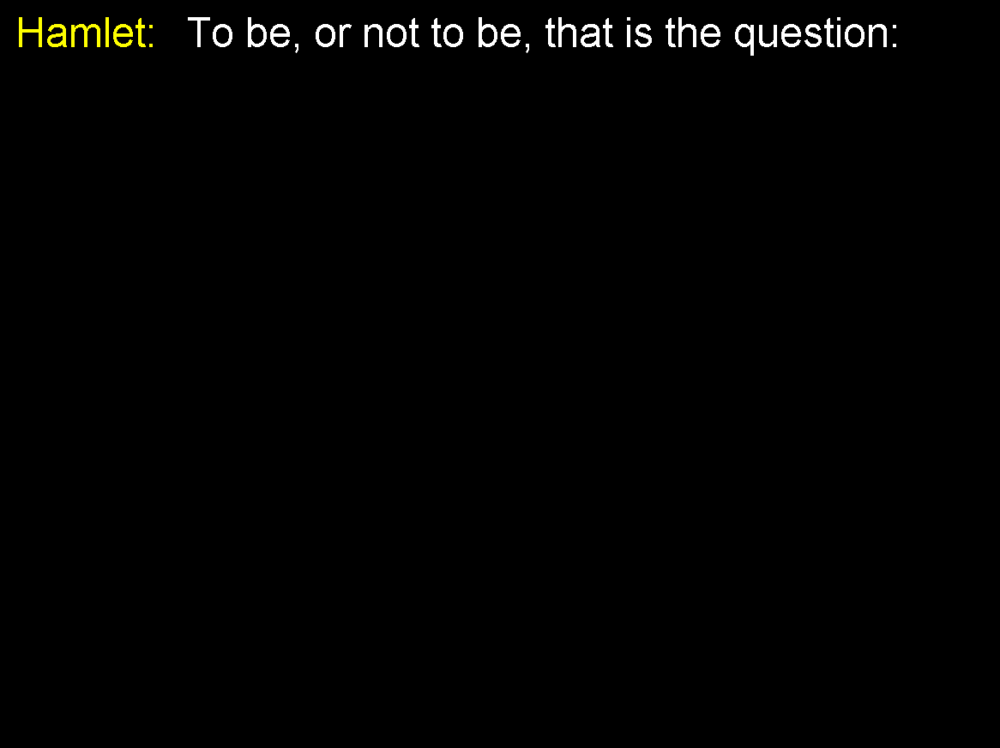
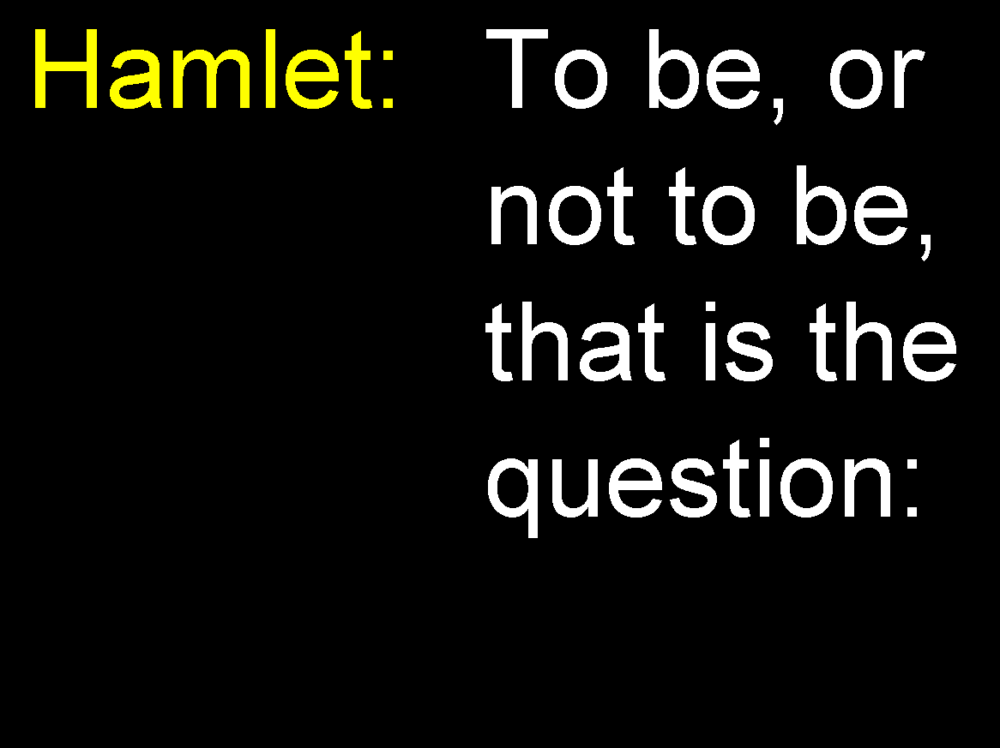

# What is it and why:

This software is for a theater to show large subtitles on a TV screen or with projector during the  play.

Current main use-case is to allow english speakers to watch shows in other languages. 

We run this from a Windows laptop connected to a projector or large screen TVs, in full screen mode.

It shows one line at a time, but breaks it down into multiple lines if necessary.

It shows white and yellow letters on a black background.

It also shows a flyer of the show.

## Usage:

SubtitleViewer subtitles.txt flyer.jpg

or just

SubtitleViewer subtitles.txt

## Keyboard shortcuts: 

- F1 Help
- F11: Toggle Fullscreen
- Escape: Close
- +/- or Left/Right: Increase/Decrease Font Size
- Up/Down or PageUp/Page Down: Previous/Next line
- A/Z Beginning/The End

## Subtitle file syntax:

just lines of text.

However, it works best if you put the character name in the beginning of the line followed by colon, like

- Hamlet: To be, or not to be, that is the question:

If some line is very long, the best practice is to break it down and start each line with the name of a character, like:

- Hamlet: To be, or not to be, 
- Hamlet: that is the question:
